# JAXAtari: GPU-Accelerated Object-Centric Atari Environments

[Documentation](https://jaxatari.readthedocs.io/en/latest/)
[License](LICENSE)

Quentin Delfosse, Raban Emunds, Paul Seitz, Jannis Blüml, Sebastian Wette, Dominik Mandok —  
[AI/ML Lab, TU Darmstadt](https://www.aiml.informatik.tu-darmstadt.de/)

[Features](#features) • [Installation](#installation) • [Quick Start](#quick-start) • [Wrappers](#wrapper-reference) • [Environments](#available-environments) • [Contributing](#contributing) • [Citation](#citation)

**JAXAtari** is a GPU-accelerated, object-centric Atari environment framework powered by [JAX](https://github.com/google/jax). Inspired by [OCAtari](https://github.com/k4ntz/OC_Atari), it enables training agents with 100M steps in under 1 hour (pixel-based observations) or under 15 minutes (object-centric observation) through JIT compilation, vectorization, and full GPU parallelization — while exposing structured, object-centric observations alongside standard pixel inputs. Similar to [HackAtari](https://github.com/k4ntz/HackAtari), it also supports game modifications for testing agent generalization.

---


<div class="collage">
  <div class="row" align="center">
    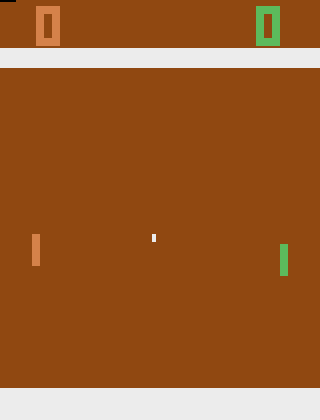
    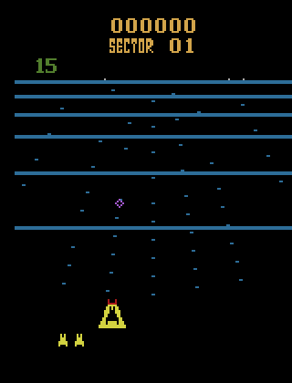
    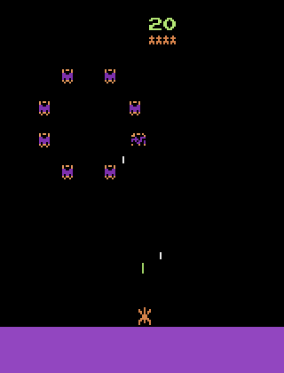
    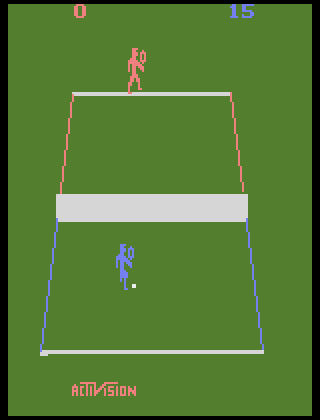
  </div>
  <div class="row" align="center">
    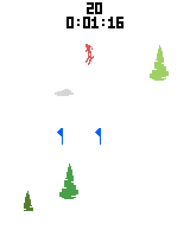
    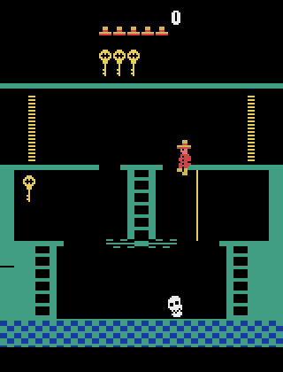
    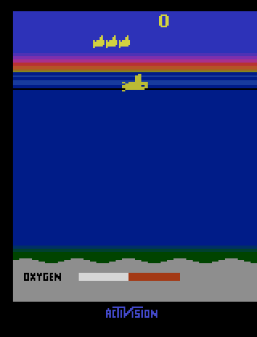
    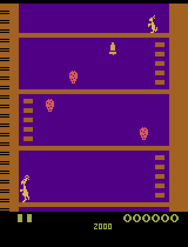
  </div>
  <div class="row" align="center">
    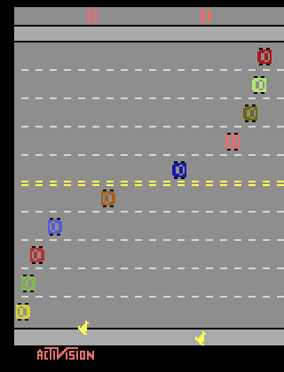
    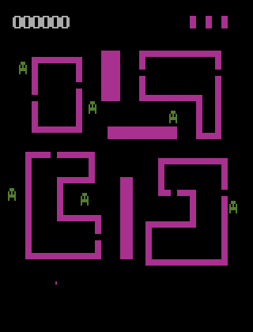
    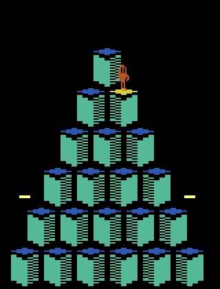
    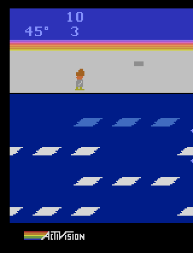
  </div>
  <div class="row" align="center">
    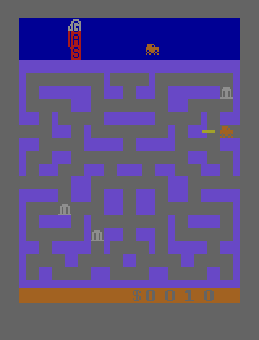
    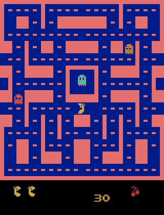
    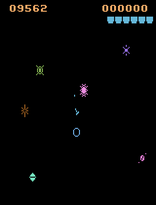
    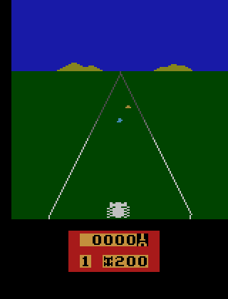
  </div>
</div>

---

## Features

- **Object-centric observations** — structured game state with per-object positions, types, and attributes
- **Full GPU pipeline** — end-to-end JAX with JIT compilation, `vmap`, and `lax.scan`; no CPU/GPU transfer bottlenecks
- **Comprehensive wrapper system** — pixel, object-centric, combined, normalized, flattened — all composable
- **Game modifications** — pre-built mods and a clean API for custom distribution shifts

📘 [Read the Documentation](https://jaxatari.readthedocs.io/en/latest/)

---

## Installation

### Basic

```bash
python3 -m venv .venv
source .venv/bin/activate
pip install -U pip
pip install -e .
```

### With development tools (tests + manual play)

Includes `pytest`, `pygame`, and testing extras:

```bash
pip install -e ".[dev]"
```

### With training scripts

Includes `wandb`, `tensorboard`, `hydra`, and other training dependencies:

```bash
pip install -e ".[training]"
```

### GPU acceleration (CUDA)

```bash
pip install -U "jax[cuda12]"
```

For other accelerators see the [JAX installation guide](https://docs.jax.dev/en/latest/installation.html).

### Download sprites

Before running any environment you will be asked to confirm ROM ownership of the original Atari ROMs. This is necessary to download the original sprites:

```bash
.venv/bin/install_sprites
```

---

## Quick Start

### Basic environment creation

```python
import jax
import jaxatari

env = jaxatari.make("pong")

# List all available games
print(jaxatari.list_available_games())
```

### Game modifications

JAXAtari ships with pre-built modifications for testing generalization:

```python
import jaxatari

# Single mod
env = jaxatari.make("pong", mods=["lazy_enemy"])

# Multiple mods simultaneously
env = jaxatari.make("pong", mods=["lazy_enemy", "shift_enemy"])
```

### Applying wrappers

Wrappers must be applied in order: `AtariWrapper` first, then an observation wrapper, then optional utility wrappers.

```python
import jaxatari
from jaxatari.wrappers import (
    AtariWrapper,
    ObjectCentricWrapper,
    PixelObsWrapper,
    PixelAndObjectCentricWrapper,
    FlattenObservationWrapper,
    NormalizeObservationWrapper,
    LogWrapper,
)

base_env = jaxatari.make("pong")
atari_env = AtariWrapper(base_env)

# Choose one observation type:
env = ObjectCentricWrapper(atari_env, frame_stack_size=4, frame_skip=4)          # shape: (frame_stack, features)
# env = PixelObsWrapper(atari_env)             # shape: (frame_stack, H, W, C)
# env = PixelAndObjectCentricWrapper(atari_env) # both

# Optional: flatten to 1D
env = FlattenObservationWrapper(env)

# Optional: normalize observations to [0, 1]
env = NormalizeObservationWrapper(env)

# Optional: track episode returns and lengths
env = LogWrapper(env)
```

### Vectorized stepping

```python
import jax
import jaxatari
from jaxatari.wrappers import AtariWrapper, ObjectCentricWrapper, FlattenObservationWrapper

env = FlattenObservationWrapper(ObjectCentricWrapper(AtariWrapper(jaxatari.make("pong"))))

n_envs = 1024
rng = jax.random.PRNGKey(0)
reset_keys = jax.random.split(rng, n_envs)

# Initialise n_envs parallel environments
obs, env_state = jax.vmap(env.reset)(reset_keys)

# Single parallel step
action = jax.random.randint(rng, (n_envs,), 0, env.action_space().n)
obs, env_state, reward, terminated, truncated, info = jax.vmap(env.step)(env_state, action)

# 100 steps with scan
def step_fn(carry, _):
    obs, state = carry
    new_obs, new_state, reward, terminated, truncated, info = jax.vmap(env.step)(state, action)
    return (new_obs, new_state), (reward, terminated, truncated, info)

_, (rewards, terminations, truncations, infos) = jax.lax.scan(
    step_fn, (obs, env_state), None, length=100
)
```

### Gymnasium compatibility *(WIP)*

> **Note:** This wrapper is currently work in progress and supports interoperability with CPU-based Gymnasium pipelines (e.g. stable-baselines3). It currently only exposes pixel observations and does not accept JAXAtari wrappers. For JAX-native training use the wrapper stack above instead.

```python
from jaxatari.gym_wrapper import GymnasiumJaxAtariWrapper
import jaxatari

base_env = jaxatari.make("pong")
gym_env = GymnasiumJaxAtariWrapper(base_env)

obs, info = gym_env.reset()
obs, reward, terminated, truncated, info = gym_env.step(gym_env.action_space.sample())
```

### Multiple reward functions

Use `MultiRewardWrapper` to compute several reward signals in parallel (apply it directly after the base environment, before any other wrapper):

```python
import jaxatari
from jaxatari.wrappers import MultiRewardWrapper, AtariWrapper, ObjectCentricWrapper, MultiRewardLogWrapper

def survival_reward(prev_state, state):
    return 1.0  # reward every surviving step

def score_delta(prev_state, state):
    return state.score - prev_state.score

base_env = jaxatari.make("pong")
env = MultiRewardWrapper(base_env, reward_funcs=[survival_reward, score_delta])
env = ObjectCentricWrapper(AtariWrapper(env))
env = MultiRewardLogWrapper(env)
```

### Manual play

```bash
# requires the [dev] extra (pygame)
python3 scripts/play.py -g Pong --mods lazy_enemy
```

---

## Wrapper Reference

All wrappers live in `src/jaxatari/wrappers.py`. The standard stack is:

```
base env  →  [MultiRewardWrapper]  →  AtariWrapper  →  <obs wrapper>  →  [utility wrappers]
```


| Wrapper                        | Description                                                                                                                            |
| ------------------------------ | -------------------------------------------------------------------------------------------------------------------------------------- |
| `AtariWrapper`                 | Atari-specific pre-processing: sticky actions, episodic life, noop reset, frame-skip config. Must come before any observation wrapper. |
| `ObjectCentricWrapper`         | Stacked object-centric features. Output shape: `(frame_stack, features)`.                                                              |
| `PixelObsWrapper`              | Stacked pixel frames with max-pooling. Output shape: `(frame_stack, H, W, C)`.                                                         |
| `PixelAndObjectCentricWrapper` | Both pixel and object-centric observations as a tuple.                                                                                 |
| `PixelAndObjectObsWrapper`     | Same as above but returns structured (non-flattened) OC observations.                                                                  |
| `FlattenObservationWrapper`    | Flattens any observation pytree to a single 1D array.                                                                                  |
| `NormalizeObservationWrapper`  | Normalizes observations to `[0, 1]` (or `[-1, 1]` with `to_neg_one=True`). Compatible with any pytree structure.                       |
| `LogWrapper`                   | Tracks episode returns and lengths.                                                                                                    |
| `MultiRewardWrapper`           | Computes multiple reward functions at every step. Apply before `AtariWrapper`.                                                         |
| `MultiRewardLogWrapper`        | Tracks multiple reward components separately. Use with `MultiRewardWrapper`.                                                           |


---

## Available Environments

A full status overview with quality ratings is in [games_covered.md](games_covered.md). Featured environments:


| Environment | Mods available |
| ----------- | -------------- |
| Pong        | 9              |
| Beamrider   | 8              |
| Phoenix     | 11             |
| Tennis      | 13             |
| Skiing      | 20             |
| Montezuma   | 15             |
| Seaquest    | 7              |
| Kangaroo    | 42             |
| Freeway     | 13             |
| Venture     | 9              |
| Qbert       | 16             |
| Frostbite   | 14             |
| Bankheist   | 14             |
| Ms. PacMan  | 12             |
| Gravitar    | 15             |
| Enduro      | 12             |


---

## Project Structure

```
JAXAtari/
├── src/jaxatari/
│   ├── core.py              # make() factory, game and mod registries
│   ├── environment.py       # JaxEnvironment base class
│   ├── wrappers.py          # all wrappers
│   ├── modification.py      # mod system (plugins, conflict detection)
│   ├── gym_wrapper.py       # Gymnasium compatibility adapter
│   ├── renderers.py         # JAX rendering utilities
│   ├── spaces.py            # action/observation space definitions
│   ├── install_sprites.py   # sprite download script
│   └── games/
│       ├── jax_<game>.py    # one file per environment
│       └── mods/
│           ├── <game>_mods.py          # mod controller per game
│           └── <game>/
│               └── <game>_mod_plugins.py  # individual mod plugin classes
├── scripts/                 # see scripts/README.md for a full description
│   ├── play.py              # interactive human play
│   └── benchmarks/          # PPO/PQN training and evaluation scripts
├── tests/                   # pytest test suite
├── docs/                    # Sphinx documentation source
├── games_covered.md         # full environment status table
└── pyproject.toml
```

---

## Contributing

Contributions are welcome! See [CONTRIBUTING.md](CONTRIBUTING.md) for detailed guides on adding mods, environments, and wrappers. Quick overview below.

### Adding a new environment

1. Create `src/jaxatari/games/jax_<game>.py` implementing `JaxEnvironment`
2. Register it in `GAME_MODULES` in `src/jaxatari/core.py`
3. Add a test in `tests/games/`
4. Update your game's status in [games_covered.md](games_covered.md)

### Adding a mod

1. Create `src/jaxatari/games/mods/<game>/<game>_mod_plugins.py` with your plugin class(es) extending `JaxAtariInternalModPlugin` or `JaxAtariPostStepModPlugin`
2. Create or update `src/jaxatari/games/mods/<game>_mods.py` — add your mod key to the `REGISTRY` dict
3. Register the controller in `MOD_MODULES` in `src/jaxatari/core.py` (if not already present)

### Adding a wrapper

1. Subclass `JaxatariWrapper` in `src/jaxatari/wrappers.py`
2. Implement `reset()`, `step()`, and `observation_space()` / `action_space()`
3. Export it from `src/jaxatari/__init__.py`

### General

1. Fork this repository
2. Create a feature branch: `git checkout -b feature/my-feature`
3. Commit your changes and open a pull request

Feel free to share new mods or environments by opening a PR!

---

## Citation

```bibtex
@misc{jaxatari2026,
  author = {Delfosse, Quentin and Emunds, Raban and Seitz, Paul and Wette, Sebastian and Bl{\"u}ml, Jannis and Kersting, Kristian},
  title = {JAXAtari: A High-Performance Framework for Reasoning agents},
  year = {2026},
  publisher = {GitHub},
  journal = {GitHub repository},
  howpublished = {https://github.com/k4ntz/JAXAtari/},
}
```

---

## License

This project is licensed under the MIT License — see [LICENSE](LICENSE) for details.
