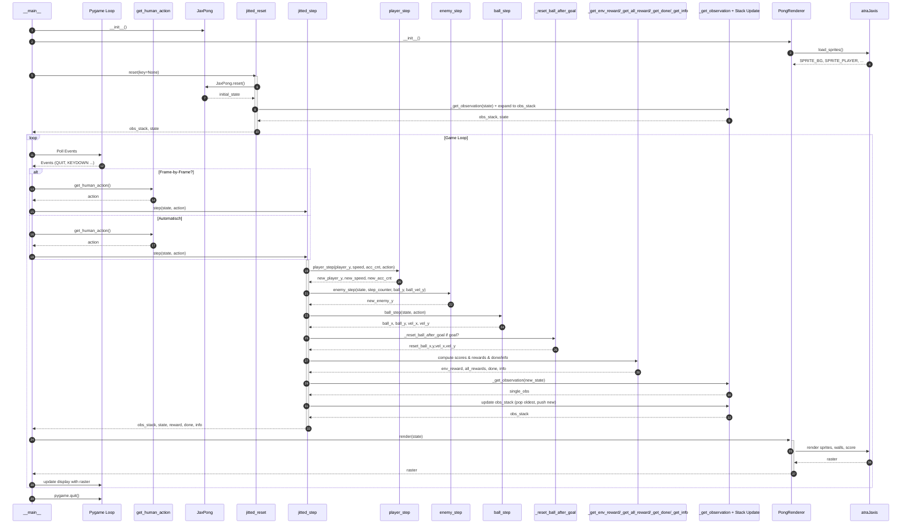

## Sequence diagram pong

```mermaid
sequenceDiagram
    autonumber
    participant Main as __main__
    participant Pygame as Pygame Loop
    participant getAction as get_human_action
    participant Env as JaxPong
    participant ResetFn as jitted_reset
    participant StepFn as jitted_step
    participant PlayerStep as player_step
    participant EnemyStep as enemy_step
    participant BallStep as ball_step
    participant ResetBall as _reset_ball_after_goal
    participant RewardFns as _get_env_reward/_get_all_reward/_get_done/_get_info
    participant Observation as _get_observation + Stack Update
    participant Renderer as PongRenderer
    participant AJ as atraJaxis

    %% Initialisierung
    Main->>Env: __init__()
    Main->>Renderer: __init__()
    activate Renderer
    Renderer->>AJ: load_sprites()
    AJ-->>Renderer: SPRITE_BG, SPRITE_PLAYER, ...

    %% Reset vor Spielstart
    Main->>ResetFn: reset(key=None)
    activate ResetFn
    ResetFn->>Env: JaxPong.reset()
    Env-->>ResetFn: initial_state
    ResetFn->>Observation: _get_observation(state) + expand to obs_stack
    Observation-->>ResetFn: obs_stack, state
    ResetFn-->>Main: obs_stack, state
    deactivate ResetFn

    %% Haupt-Spielschleife
    loop Game Loop
        Main->>Pygame: Poll Events
        Pygame-->>Main: Events (QUIT, KEYDOWN ...)
        alt Frame-by-Frame?
            Main->>getAction: get_human_action()
            getAction-->>Main: action
            Main->>StepFn: step(state, action)
        else Automatisch
            Main->>getAction: get_human_action()
            getAction-->>Main: action
            Main->>StepFn: step(state, action)
        end
        activate StepFn

        %% Spiel-Logik in step()
        StepFn->>PlayerStep: player_step(player_y, speed, acc_cnt, action)
        PlayerStep-->>StepFn: new_player_y, new_speed, new_acc_cnt

        StepFn->>EnemyStep: enemy_step(state, step_counter, ball_y, ball_vel_y)
        EnemyStep-->>StepFn: new_enemy_y

        StepFn->>BallStep: ball_step(state, action)
        BallStep-->>StepFn: ball_x, ball_y, vel_x, vel_y

        StepFn->>ResetBall: _reset_ball_after_goal if goal?
        ResetBall-->>StepFn: reset_ball_x,y,vel_x,vel_y

        StepFn->>RewardFns: compute scores & rewards & done/info
        RewardFns-->>StepFn: env_reward, all_rewards, done, info

        %% Observation erzeugen und Stack aktualisieren
        StepFn->>Observation: _get_observation(new_state)
        Observation-->>StepFn: single_obs
        StepFn->>Observation: update obs_stack (pop oldest, push new)
        Observation-->>StepFn: obs_stack

        StepFn-->>Main: obs_stack, state, reward, done, info
        deactivate StepFn

        %% Rendering
        Main->>Renderer: render(state)
        activate Renderer
        Renderer->>AJ: render sprites, walls, score
        AJ-->>Renderer: raster
        Renderer-->>Main: raster
        deactivate Renderer

        Main->>Pygame: update display with raster
    end
    Main->>Pygame: pygame.quit()

```
